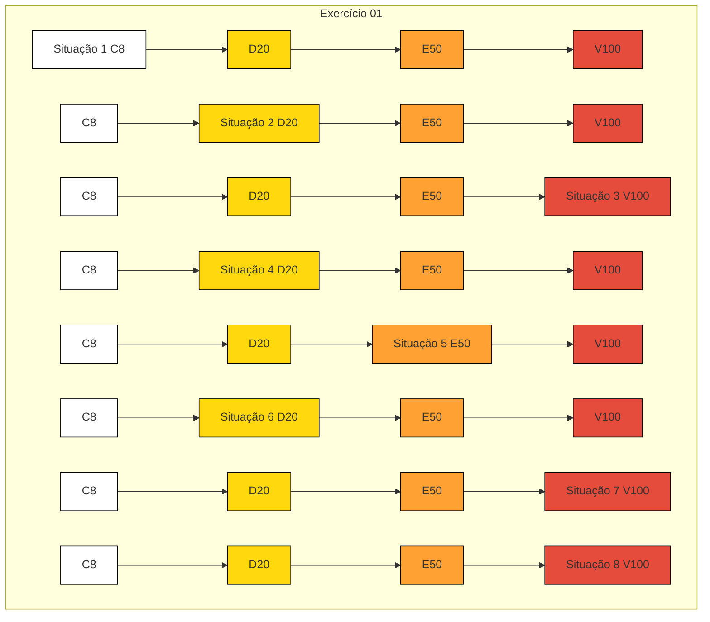
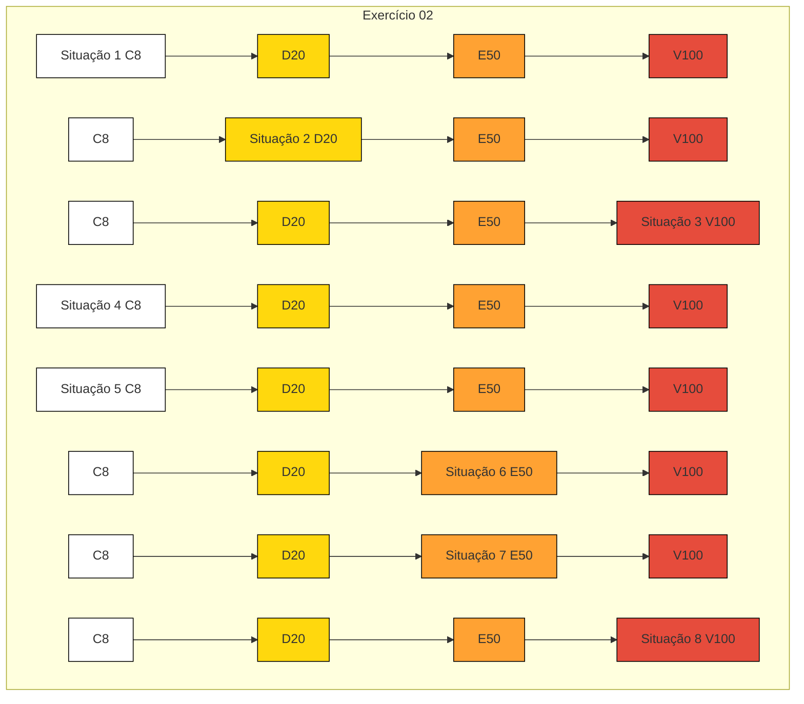

# metodo-agil-crystal

```mermaid
graph TD
  subgraph Exercício 01
    A1["Situação 1 C8"]:::branco --> A2["D20"]:::amarelo --> A3["E50"]:::laranja --> A4["V100"]:::vermelho
    B1["C8"]:::branco --> B2["Situação 2 D20"]:::amarelo --> B3["E50"]:::laranja --> B4["V100"]:::vermelho
    C1["C8"]:::branco --> C2["D20"]:::amarelo --> C3["E50"]:::laranja --> C4["Situação 3 V100"]:::vermelho
    D1["C8"]:::branco --> D2["Situação 4 D20"]:::amarelo --> D3["E50"]:::laranja --> D4["V100"]:::vermelho
    E1["C8"]:::branco --> E2["D20"]:::amarelo --> E3["Situação 5 E50"]:::laranja --> E4["V100"]:::vermelho
    F1["C8"]:::branco --> F2["Situação 6 D20"]:::amarelo --> F3["E50"]:::laranja --> F4["V100"]:::vermelho
    G1["C8"]:::branco --> G2["D20"]:::amarelo --> G3["E50"]:::laranja --> G4["Situação 7 V100"]:::vermelho
    H1["C8"]:::branco --> H2["D20"]:::amarelo --> H3["E50"]:::laranja --> H4["Situação 8 V100"]:::vermelho
  end
 
  %% Definições de estilo
  classDef branco fill:#ffffff,stroke:#000,stroke-width:1px;
  classDef amarelo fill:#FFD80D,stroke:#000,stroke-width:1px;
  classDef laranja fill:#FFA233,stroke:#000,stroke-width:1px;
  classDef vermelho fill:#E64C3C,stroke:#000,stroke-width:1px;
 
```
 
# Metodo-Agil-Crystal
 

```mermaid
graph TD
  subgraph Exercício 02
    A1["Situação 1 C8"]:::branco --> A2["D20"]:::amarelo --> A3["E50"]:::laranja --> A4["V100"]:::vermelho
    B1["C8"]:::branco --> B2["Situação 2 D20"]:::amarelo --> B3["E50"]:::laranja --> B4["V100"]:::vermelho
    C1["C8"]:::branco --> C2["D20"]:::amarelo --> C3["E50"]:::laranja --> C4["Situação 3 V100"]:::vermelho
    D1["Situação 4 C8"]:::branco --> D2["D20"]:::amarelo --> D3["E50"]:::laranja --> D4["V100"]:::vermelho
    E1["Situação 5 C8"]:::branco --> E2["D20"]:::amarelo --> E3["E50"]:::laranja --> E4["V100"]:::vermelho
    F1["C8"]:::branco --> F2["D20"]:::amarelo --> F3["Situação 6 E50"]:::laranja --> F4["V100"]:::vermelho
    G1["C8"]:::branco --> G2["D20"]:::amarelo --> G3["Situação 7 E50"]:::laranja --> G4["V100"]:::vermelho
    H1["C8"]:::branco --> H2["D20"]:::amarelo --> H3["E50"]:::laranja --> H4["Situação 8 V100"]:::vermelho
  end
 
  %% Definições de estilo
  classDef branco fill:#ffffff,stroke:#000,stroke-width:1px;
  classDef amarelo fill:#FFD80D,stroke:#000,stroke-width:1px;
  classDef laranja fill:#FFA233,stroke:#000,stroke-width:1px;
  classDef vermelho fill:#E64C3C,stroke:#000,stroke-width:1px;
 
```
